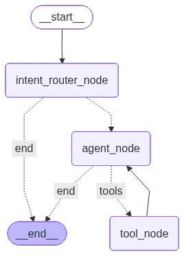
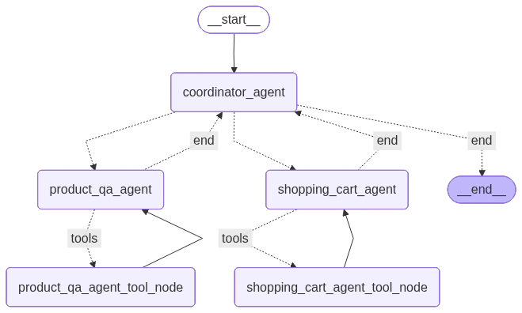
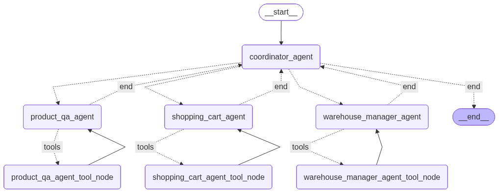
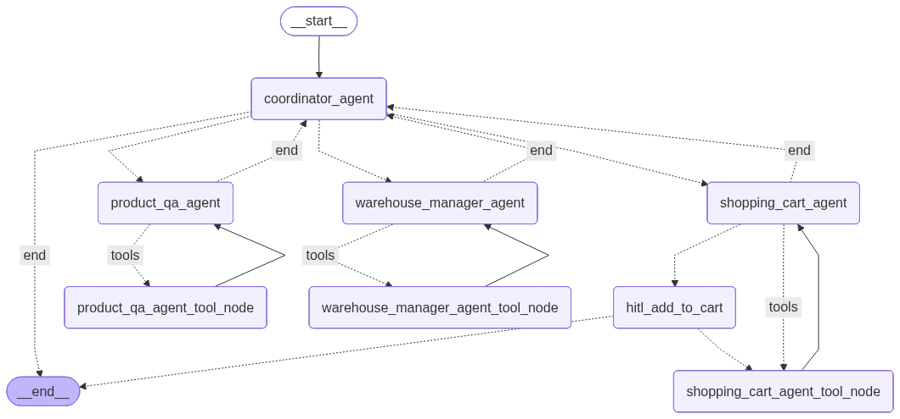

<a href="./README.md">🇨🇳 中文</a> | <a href="./README_EN.md">🇺🇸 English</a>

# ai_projects

## 项目信息

### ai_project_prototype

基于 Streamlit 和 FastAPI 的 AI 项目原型

### agentic_rag (Amazon Shopping Assistant)

基于 LangGraph 多智能体与 Agentic RAG 的 AI 智能购物助手

------


## 开发环境

Windows11

Python 3.12 or 3.14

uv python 包管理器

cursor IDE

------


## 运行环境

Docker Desktop

若 Docker 占用磁盘过多，执行以下指令进行清理

```
docker system df				# 查看 Docker 磁盘占用情况
docker image ls					# 查看本地镜像
docker ps -a					# 查看本地容器

docker builder prune -a			# 删除所有构建缓存
docker container prune -f		# 删除所有已退出的容器
docker image prune -a			# 删除没有任何容器引用的镜像
```

清理后，在指定子项目根目录下重新构建即可

```
uv sync
docker compose up --build	
```

------


## 环境搭建

1. 安装 [Python](https://www.python.org/) (3.12 或 3.14)

2. 安装 [uv](https://docs.astral.sh/uv/getting-started/installation/)

3. 安装 [cursor IDE](https://cursor.com/)

4. 安装 [Docker Desktop](https://www.docker.com/) 并运行

5. 安装指定项目虚拟环境 

   - 指定项目 根目录 下执行

     ```
     uv sync
     ```

6. 选择 Python Interpreter

   - Cursor IDE 中选择

     ```
     Ctrl + Shift + P
     ```

7. 按照 env.example 的格式设置 .env

8. 初始化 Qdrant 向量数据库并录入数据 (商品信息)

   - 录入方式详见 notbooks

9. 初始化 Postgres 数据库并录入数据 (购物车 & 商品库存)

   - 录入方式详见 notbooks

10. 启动指定项目

   - 指定项目 根目录 下执行

     ```
     uv sync
     docker compose up --build	# 第一次构建容器需执行
     docker compose up 			# 后续启动容器需执行
     ```

   - 通过浏览器访问 FastAPI 后端服务，Streamlit 前端服务和 Qdrant 向量数据库

     ```
     http://localhost:8501
     http://localhost:8000/docs
     http://localhost:6333/dashboard
     ```


------


## 已完成内容

1. 项目原型构建: 
   - Streamlit 实现前端服务 
   - FastAPI 封装后端服务

2. RAG 流程实现：

   - 数据集获取 & 提取
   - Qdrant 向量数据库部署
   - 数据集 Embedding 处理 & 存入数据库
   - RAG 流程实现
   - LangSmith 可观测 debug 平台部署
   - 测试集生成 & 存入数据库
   - RAG 评估 **(未实现)**

     ```
     ragas (old version have issues)
     ```
   - 结构化输出实现

     ```
     Pydantic + Instructor
     ```
   - 混合检索实现

     ```
     Embedding 相似度 + bm25 关键词检索 
     ```

   - 混合检索结果重新排列

     ```
     Cohere / Qwen Rerank / BGE Reranker
     ```

   - Prompt 管理实现

     ```
     jinja2
     ```

3. Agentic RAG 系统实现：

   - 重构固定 RAG 流程为 ReAct-Style Tool Calling Agent

     ```
     LangGraph: 用户意图识别 + 用户查询重写 + ReAct-Style Tool Calling 
     RAG 变成一个 tool 供 agent 调用
     ```

     

   - 多轮对话实现

     ```
     PostgresSQL 数据库: 存储 Agent 运行状态 & Checkpoint 聊天历史
     ```

   - 商品评论数据集写入 Qdrant & 商品查询查询 Tool 实现

   - 接收用户反馈功能实现

   - MCP 封装 Tools **(未实现)**

   - Agent 工作流状态 流式输出功能 实现

     ```
     SSE (Server-Sent Events)
     ```

4. Multi-Agent 系统实现：

   - 购物车数据库初始化 & 数据库增删改查工具实现

     ```
     Postgres SQL + DBeaver 数据库可视化工具
     ```

   - 重构 单智能体架构 为 多智能体架构

     ```
     Coordinator Agent + (Product QnA Agent / Shopping Cart Agent)
     ```

     

   

   - 商品仓库&库存数据库初始化 & 库存查询/预留工具实现

     ```
     Postgres SQL + DBeaver 数据库可视化工具
     ```

   - 多智能体架构升级

     ```
     Coordinator Agent + (Product QnA Agent / Shopping Cart Agent / Warehouse Manager Agent )
     ```

     

   - Google Agent Development Kit 尝试 **(可选)** **(未实现)**

     ```
     重构 warehouse_manager_agent
     ```

   - A2A 协议尝试 **(可选)** **(未实现)**

5. LLMOps 实现：

   - 引入多个 LLM APIs，提高系统健壮性

     ```
     LiteLLM
     ```

   - Prompt Caching 日志实现
   
     ```
     LangSmith
     ```
   
   - 购物车操作 Human in the loop 实现
   
     ```
     添加 hitl 节点，等待用户确认 or 拒绝指定操作
     ```
   
     
   
   - 项目部署到云端运行 **(未实现)**
   
     ```
     Qdrant → Qdrant Cloud
     Postgres → Superbase
     ```
     
     
